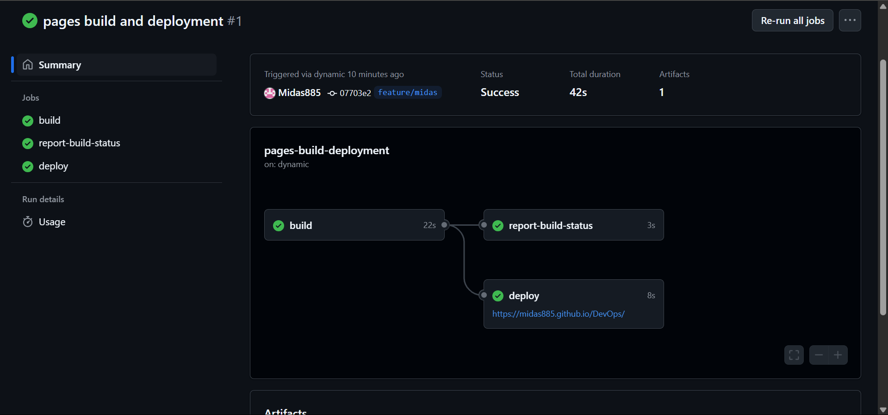

# DevOps

# Web App con Pipeline CI/CD

[](https://midas885.github.io/DevOps/)


## Descripción
Aplicación web de ejemplo con un pipeline CI/CD automatizado usando GitHub Actions.

## Estructura del Proyecto
.
├── .github/workflows

│ └── ci-cd.yml # Configuración del pipeline

├── src

│ ├── app.js # Lógica de la aplicación

│ └── index.js # Punto de entrada

├── tests

│ └── test.js # Pruebas unitarias

├── public

│ └── index.html # Sitio web desplegado

└── package.json # Dependencias y scripts


## Pipeline CI/CD
### Etapas:
1. **Build**: Instalación de dependencias
2. **Test**: Ejecución de pruebas unitarias con cobertura
3. **Deploy**: Despliegue automático a GitHub Pages

### Trigger:
- Push a `main`
- Pull requests a `main`

---

## 3. Demostración del Pipeline Funcionando

### Evidencia de ejecución:
1. **Captura de pantalla del workflow ejecutándose:**  
   

2. **Sitio desplegado en GitHub Pages:**  
   [https:https://midas885.github.io/DevOps/](https://midas885.github.io/DevOps/)

---

## 4. Informe de Implementación

### **Proceso Seguido**
1. **Configuración Inicial:**
   - Se creó un repositorio con estructura Node.js básica
   - Se implementó una función de suma con su prueba unitaria

2. **GitHub Actions:**
   - Workflow configurado en `.github/workflows/ci-cd.yml`
   - Tres jobs principales: instalación, pruebas y despliegue
   - Integración con GitHub Pages usando `actions-gh-pages`

3. **Pruebas:**
   - Configuración de Jest para cobertura de código
   - Umbral mínimo de cobertura configurado (80%)


### **Lecciones Aprendidas**
- Los workflows de GitHub Actions son sensibles a la indentación (YAML)
- El token `GITHUB_TOKEN` se genera automáticamente, no necesita configuración manual
- GitHub Pages requiere el archivo `index.html` en la raíz del directorio `public`

### **Mejoras Futuras**
1. Agregar pruebas E2E con Cypress
2. Implementar notificaciones en Slack
3. Añadir análisis de código con SonarCloud

---

### **Cómo Verificar el Funcionamiento**
1. Clona el repositorio:
   ```bash
   git clone https://github.com/tu-usuario/web-app-ci-cd.git

